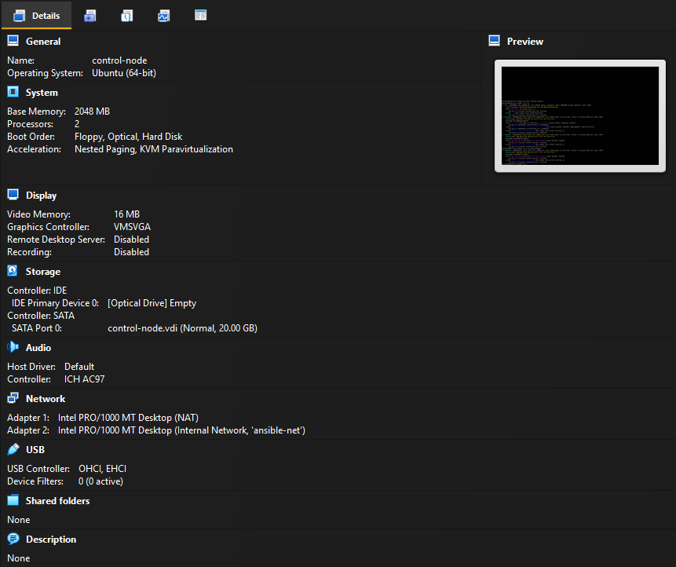
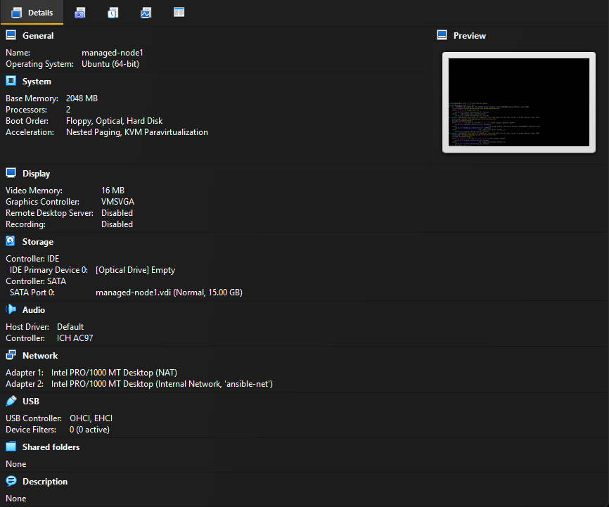
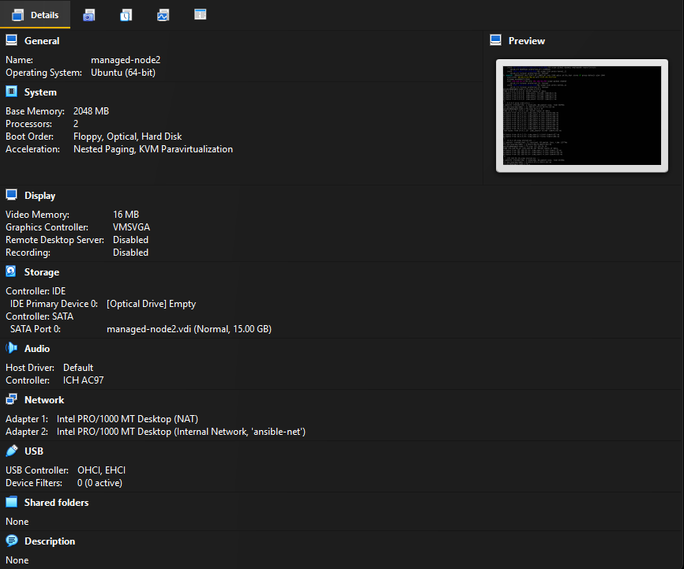
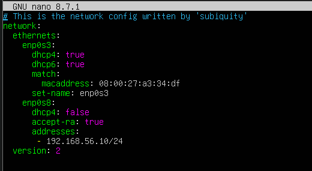
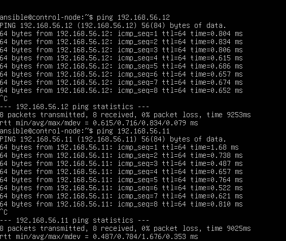

# Ansible Infrastructure Automation Project

**Module:** Administration Systemes et Reseaux
**Authors:** Group of 2 students
**Subject:** Project 11 — Infrastructure Automation with Ansible

---

## Project Overview

This project implements infrastructure automation using Ansible across a local virtual lab. Three Ubuntu Server VMs are provisioned and configured from a single control node using Ansible playbooks and roles, covering SSH-based communication, inventory management, service deployment, Docker containerization, and multi-node application deployment.

---

## Infrastructure Architecture

```
                        NAT (Internet Access)
                               |
            +------------------+------------------+
            |                  |                  |
     [control-node]      [managed-node-1]   [managed-node-2]
     192.168.56.10        192.168.56.11      192.168.56.12
            |                  |                  |
            +------------------+------------------+
                    Internal Network: ansible-net
                      (SSH communication only)
```

| VM Name | Role | RAM | Disk | Internal IP |
|---|---|---|---|---|
| control-node | Ansible Control | 2 GB | 20 GB | 192.168.56.10 |
| managed-node-1 | Managed Target (App) | 2 GB | 15 GB | 192.168.56.11 |
| managed-node-2 | Managed Target (DB) | 2 GB | 15 GB | 192.168.56.12 |

---

## Environment Requirements

| Component | Details |
|---|---|
| Host OS | Windows or Linux with VirtualBox |
| Hypervisor | Oracle VirtualBox |
| Guest OS | Ubuntu Server 26.04 LTS |
| Ansible Version | 2.x (installed on control node only) |
| Network Mode 1 | NAT (internet access) |
| Network Mode 2 | Internal Network named `ansible-net` |

---

## Project Structure

```
├── README.md
├── .gitignore
├── ansible-project/
│   ├── ansible.cfg
│   ├── inventory.ini
│   ├── collections/
│   │   └── requirements.yml
│   ├── group_vars/
│   │   └── all.yml
│   ├── playbooks/
│   │   ├── install_apache.yml          # Phase 4
│   │   ├── install_nginx.yml           # Phase 4
│   │   ├── create_users.yml            # Phase 4
│   │   └── deploy_app.yml              # Phase 5
│   └── roles/
│       ├── cleanup/
│       │   └── tasks/main.yml
│       ├── common/
│       │   └── tasks/main.yml
│       ├── database/
│       │   └── tasks/main.yml
│       └── webserver/
│           ├── tasks/main.yml
│           └── templates/
│               ├── Dockerfile.j2
│               ├── docker-compose.yml.j2
│               ├── hello.py.j2
│               ├── nginx.conf.j2
│               └── requirements.txt.j2
└── docs/
    ├── phase1-vm-setup.md
    ├── phase2-network-config.md
    ├── phase3-ssh-ansible.md
    ├── phase4-playbooks.md
    ├── phase5-app-deployment.md
    └── screenshots/
        ├── phase1_vm_setup/
        ├── phase2_network/
        ├── phase3_ssh_ansible/
        ├── phase4_playbooks/
        └── phase5_app_deployment/
```

---

## Project Phases

| Phase | Description | Documentation |
|---|---|---|
| Phase 1 | Virtual Machine Setup in VirtualBox | [docs/phase1-vm-setup.md](docs/phase1-vm-setup.md) |
| Phase 2 | Network Configuration with Netplan | [docs/phase2-network-config.md](docs/phase2-network-config.md) |
| Phase 3 | SSH & Ansible Configuration | [docs/phase3-ssh-ansible.md](docs/phase3-ssh-ansible.md) |
| Phase 4 | Ansible Playbooks (Apache, Nginx, Users) | [docs/phase4-playbooks.md](docs/phase4-playbooks.md) |
| Phase 5 | Roles & App Deployment (Docker + Flask + MariaDB) | [docs/phase5-app-deployment.md](docs/phase5-app-deployment.md) |

---

### Phase 1 — Virtual Machine Setup

Three VMs were created in VirtualBox with Ubuntu Server 26.04 LTS. Each VM was configured with two network adapters: NAT for internet access and an Internal Network (`ansible-net`) for inter-VM communication.







> Full details: [Phase 1 — VM Setup](docs/phase1-vm-setup.md)

---

### Phase 2 — Network Configuration

Static IPs were assigned to the internal network interface (`enp0s8`) on each VM using Netplan, and connectivity was verified with ping tests.





> Full details: [Phase 2 — Network Configuration](docs/phase2-network-config.md)

---

### Phase 3 — SSH & Ansible Configuration

SSH key authentication was configured from the control node to both managed nodes. An Ansible inventory was created and connectivity was verified with `ansible -m ping`.


> Full details: [Phase 3 — SSH & Ansible](docs/phase3-ssh-ansible.md)

---

### Phase 4 — Ansible Playbooks

Playbooks were created to automate Apache installation on node1, Nginx installation on node2, and user creation across both nodes.


> Full details: [Phase 4 — Playbooks](docs/phase4-playbooks.md)

---

### Phase 5 — Roles & Application Deployment

Ansible roles were introduced to deploy a multi-node application: Nginx reverse proxy + Flask backend (Docker Compose) on node1, and MariaDB (Docker container) on node2.


> Full details: [Phase 5 — App Deployment](docs/phase5-app-deployment.md)

---

## Quick Start

To deploy the Phase 5 application from the control node:

```bash
# Install the required Ansible collection
ansible-galaxy collection install -r collections/requirements.yml

# Run the deployment playbook
ansible-playbook -i inventory.ini playbooks/deploy_app.yml

# Verify the app is running
curl http://192.168.56.11
```

Expected output:

```
Hello Blog post #1<br>Hello Blog post #2<br>Hello Blog post #3<br>Hello Blog post #4
```
