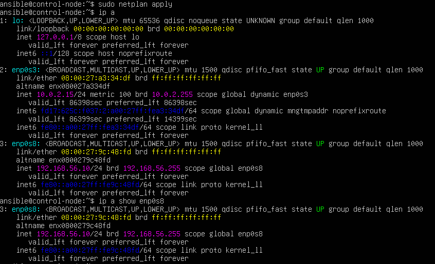
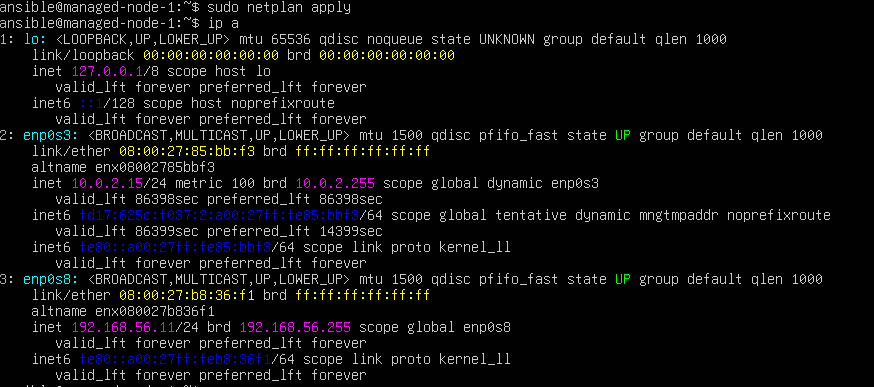
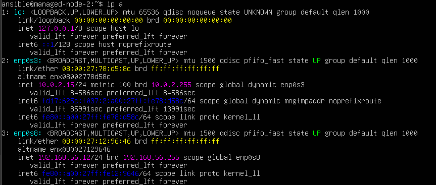

# Phase 2 — Network Configuration

## 2.1 Problem Identified

After initial installation, `ip a` was run on each VM. The `enp0s8` interface (corresponding to the internal `ansible-net` adapter) had no IP address assigned. Static IP addresses were configured manually using Netplan.

---

## 2.2 Configuring Static IPs with Netplan

On each VM, the Netplan configuration file was edited:

```
/etc/netplan/00-installer-config.yaml
```

The existing configuration for `enp0s3` (NAT interface) was preserved and a block for `enp0s8` was added with a static address.

**control-node:**

```yaml
network:
  version: 2
  ethernets:
    enp0s3:
      dhcp4: true
    enp0s8:
      dhcp4: false
      addresses:
        - 192.168.56.10/24
```

**managed-node-1:**

```yaml
network:
  version: 2
  ethernets:
    enp0s3:
      dhcp4: true
    enp0s8:
      dhcp4: false
      addresses:
        - 192.168.56.11/24
```

**managed-node-2:**

```yaml
network:
  version: 2
  ethernets:
    enp0s3:
      dhcp4: true
    enp0s8:
      dhcp4: false
      addresses:
        - 192.168.56.12/24
```

After editing each file, the configuration was applied:

```bash
sudo netplan apply
```

---

## 2.3 Verification

IP assignment was confirmed on each node:

```bash
ip a show enp0s8
```

### Screenshots








Connectivity was verified from the control node:

```bash
ping 192.168.56.11
ping 192.168.56.12
```


Both ping tests returned successful responses, confirming the internal network is operational.
