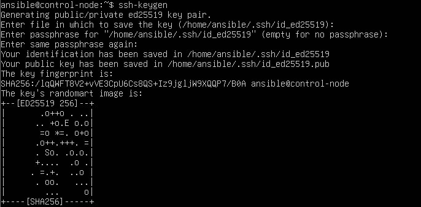
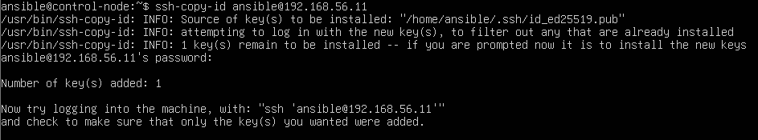
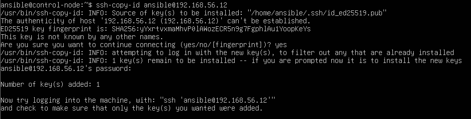
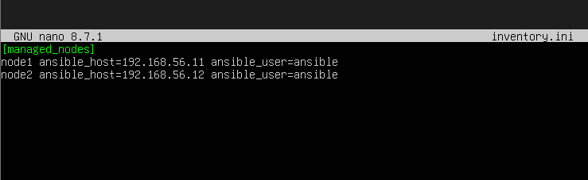
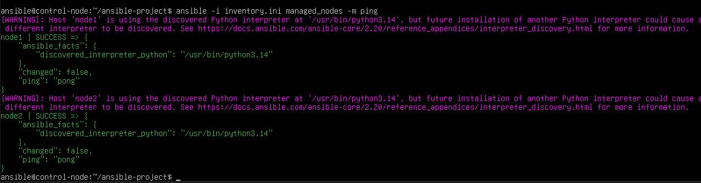

# Phase 3 — SSH Configuration for Ansible

Ansible connects to managed nodes over SSH. To avoid typing the password on every run, SSH key authentication was configured from the control node to each managed node.

---

## 3.1 Generate an SSH Key Pair

On `control-node`, an Ed25519 key was generated:

```bash
ssh-keygen -t ed25519
```

The default path (`/home/ansible/.ssh/id_ed25519`) was accepted with an empty passphrase.



---

## 3.2 Copy the Public Key to Managed Nodes

The public key was installed on each target machine:

```bash
ssh-copy-id ansible@192.168.56.11
ssh-copy-id ansible@192.168.56.12
```





---

## 3.3 (Optional) SSH Config

To avoid typing IP addresses, `~/.ssh/config` can be created:

```sshconfig
Host node1
  HostName 192.168.56.11
  User ansible
  IdentityFile ~/.ssh/id_ed25519

Host node2
  HostName 192.168.56.12
  User ansible
  IdentityFile ~/.ssh/id_ed25519
```

```bash
chmod 600 ~/.ssh/config
```

---

## 3.4 Verification

Passwordless login was verified from `control-node`:

```bash
ssh ansible@192.168.56.11
ssh ansible@192.168.56.12
```

---

## 3.5 Inventory Configuration

The Ansible inventory was created to describe the managed nodes.

`inventory.ini`:

```ini
[managed_nodes]
node1 ansible_host=192.168.56.11 ansible_user=ansible
node2 ansible_host=192.168.56.12 ansible_user=ansible
```

> This inventory was later updated in Phase 5 to add `[app]` and `[db]` groups.



---

## 3.6 Ansible Connectivity Test

Ansible connectivity was confirmed:

```bash
ansible -i inventory.ini managed_nodes -m ping
```


