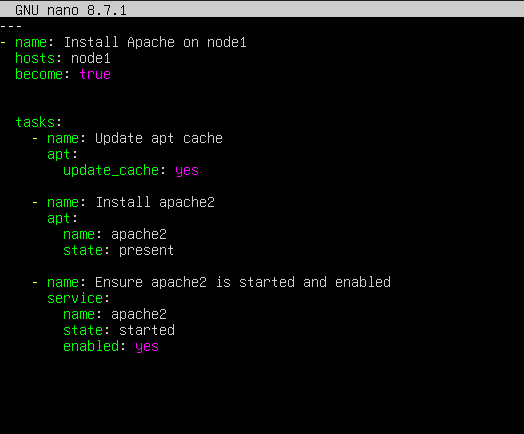
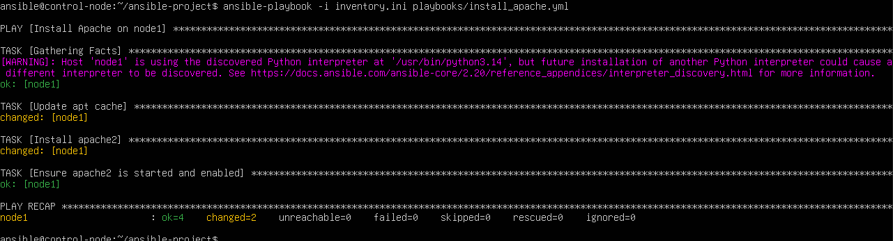
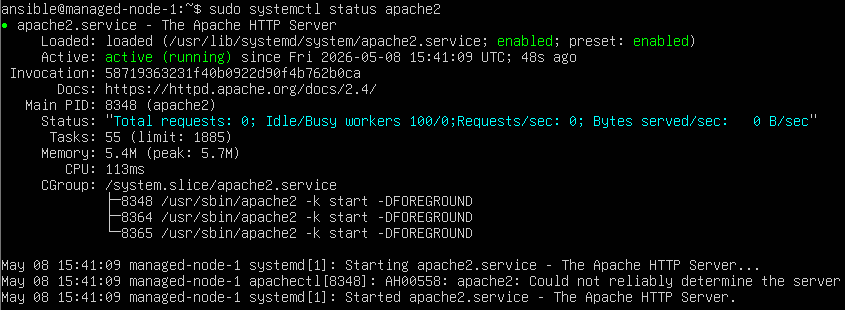
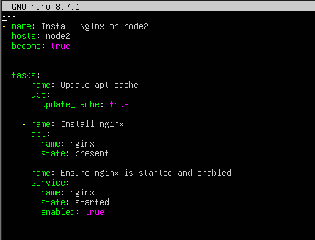
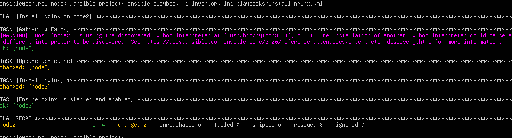
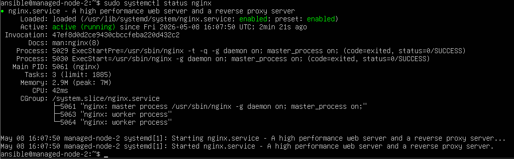
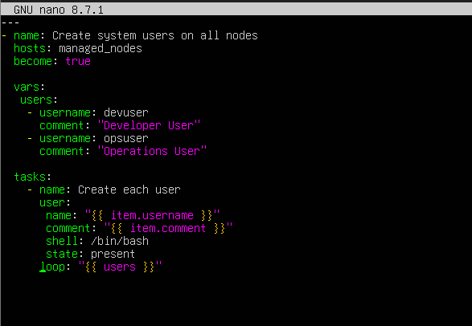
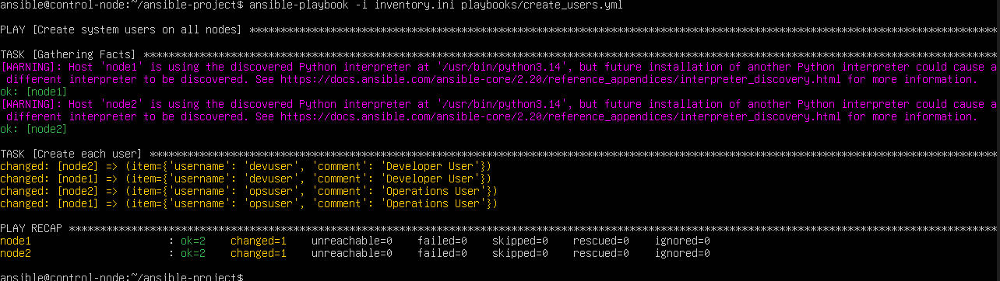

# Phase 4 — Ansible Playbooks

Ansible playbooks were created and executed from the control node to automate package installation, service management, and user creation on the managed nodes.

---

## 4.1 Privilege Escalation (sudo) Configuration

Playbooks use `become: true` for tasks that require root privileges. To avoid interactive sudo prompts, the `ansible` user was granted passwordless sudo on both managed nodes:

```bash
sudo usermod -aG sudo ansible
echo "ansible ALL=(ALL) NOPASSWD:ALL" | sudo tee /etc/sudoers.d/ansible
sudo chmod 440 /etc/sudoers.d/ansible
```

---

## 4.2 Apache Installation Playbook (node1)

**Playbook:** `ansible-project/playbooks/install_apache.yml`

```yaml
---
- name: Install Apache on node1
  hosts: node1
  become: true

  tasks:
    - name: Update apt cache
      apt:
        update_cache: true

    - name: Install apache2
      apt:
        name: apache2
        state: present

    - name: Ensure apache2 is started and enabled
      service:
        name: apache2
        state: started
        enabled: true
```

Run:

```bash
ansible-playbook -i inventory.ini playbooks/install_apache.yml
```

### Screenshots





Status verification on managed-node-1:

```bash
systemctl status apache2
```



---

## 4.3 Nginx Installation Playbook (node2)

**Playbook:** `ansible-project/playbooks/install_nginx.yml`

```yaml
---
- name: Install Nginx on node2
  hosts: node2
  become: true

  tasks:
    - name: Update apt cache
      apt:
        update_cache: true

    - name: Install nginx
      apt:
        name: nginx
        state: present

    - name: Ensure nginx is started and enabled
      service:
        name: nginx
        state: started
        enabled: true
```

Run:

```bash
ansible-playbook -i inventory.ini playbooks/install_nginx.yml
```

### Screenshots





Status verification on managed-node-2:

```bash
systemctl status nginx
```



---

## 4.4 User Creation Playbook (all managed nodes)

**Playbook:** `ansible-project/playbooks/create_users.yml`

This playbook creates the lab users `devuser` and `opsuser` on both managed nodes.

```yaml
---
- name: Create system users on all nodes
  hosts: managed_nodes
  become: true

  vars:
    users:
      - username: devuser
        comment: "Developer User"
      - username: opsuser
        comment: "Operations User"

  tasks:
    - name: Create each user
      user:
        name: "{{ item.username }}"
        comment: "{{ item.comment }}"
        shell: /bin/bash
        state: present
      loop: "{{ users }}"
```

Run:

```bash
ansible-playbook -i inventory.ini playbooks/create_users.yml
```

### Screenshots





Verification on a managed node:

```bash
getent passwd devuser
getent passwd opsuser
```
