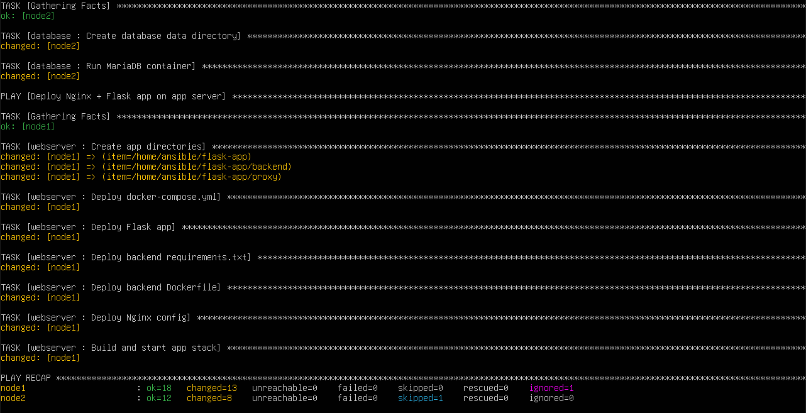
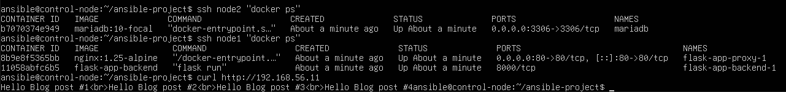

# Phase 5 — Roles & Application Deployment

This phase introduces Ansible roles and deploys a multi-node application using Docker:

| Node | Role | What runs |
|---|---|---|
| node1 (192.168.56.11) | App / Web server | Docker Compose: Nginx reverse proxy + Flask backend |
| node2 (192.168.56.12) | Database server | Docker container: MariaDB |

The Flask backend on node1 connects to MariaDB on node2 over the internal network (192.168.56.0/24).

---

## Prerequisites (from Phases 1–4)

- Three VMs running Ubuntu Server (control-node, node1, node2).
- Static IPs assigned via Netplan on the internal network.
- SSH key authentication from control-node to both managed nodes.
- Passwordless sudo for user `ansible` on managed nodes.
- Phase 4 playbooks (`install_apache.yml`, `install_nginx.yml`, `create_users.yml`) are kept for reference. The cleanup role stops those services before deploying.

---

## Updated Inventory

The inventory was updated to introduce `[app]` and `[db]` groups, with `[managed_nodes:children]` for backward compatibility with Phase 4 playbooks.

`ansible-project/inventory.ini`:

```ini
[app]
node1 ansible_host=192.168.56.11 ansible_user=ansible

[db]
node2 ansible_host=192.168.56.12 ansible_user=ansible

[managed_nodes:children]
app
db
```

---

## Group Variables

Shared variables are defined in `ansible-project/group_vars/all.yml`:

```yaml
---
# Database settings (MariaDB on node2)
db_name: example
db_user: root
db_password: changeme123
db_port: 3306

# App settings (Flask backend runs behind Nginx on node1)
flask_listen_port: 8000
```

---

## Ansible Configuration

`ansible-project/ansible.cfg`:

```ini
[defaults]
roles_path = roles
inventory = inventory.ini
```

---

## Required Collection

The `community.docker` collection is required for the database role. Install it on the control node:

```bash
ansible-galaxy collection install -r collections/requirements.yml
```

`ansible-project/collections/requirements.yml`:

```yaml
---
collections:
  - name: community.docker
```

---

## Roles

### Cleanup Role

Stops and disables Phase 4 native services so ports 80 and 3306 are free for Docker.

`ansible-project/roles/cleanup/tasks/main.yml`:

```yaml
---
- name: Stop and disable apache2 if present (node1)
  service:
    name: apache2
    state: stopped
    enabled: false
  ignore_errors: true
  when: inventory_hostname in groups['app']

- name: Stop and disable nginx if present (node1/node2)
  service:
    name: nginx
    state: stopped
    enabled: false
  ignore_errors: true
  when: inventory_hostname in groups['app'] or inventory_hostname in groups['db']
```

---

### Common Role (Docker Installation)

Installs Docker Engine and Docker Compose plugin on both nodes.

`ansible-project/roles/common/tasks/main.yml`:

```yaml
---
- name: Install required packages
  apt:
    name:
      - apt-transport-https
      - ca-certificates
      - curl
      - gnupg
      - lsb-release
    state: present
    update_cache: true

- name: Add Docker GPG key
  shell: |
    install -m 0755 -d /etc/apt/keyrings
    curl -fsSL https://download.docker.com/linux/ubuntu/gpg -o /etc/apt/keyrings/docker.asc
    chmod a+r /etc/apt/keyrings/docker.asc
  args:
    creates: /etc/apt/keyrings/docker.asc

- name: Add Docker repository
  shell: |
    echo "deb [arch=$(dpkg --print-architecture) signed-by=/etc/apt/keyrings/docker.asc] https://download.docker.com/linux/ubuntu $(. /etc/os-release && echo $VERSION_CODENAME) stable" > /etc/apt/sources.list.d/docker.list
  args:
    creates: /etc/apt/sources.list.d/docker.list

- name: Install Docker Engine and Compose plugin
  apt:
    name:
      - docker-ce
      - docker-ce-cli
      - containerd.io
      - docker-compose-plugin
    state: present
    update_cache: true

- name: Add ansible user to docker group
  user:
    name: ansible
    groups: docker
    append: true

- name: Ensure Docker is started and enabled
  service:
    name: docker
    state: started
    enabled: true
```

---

### Database Role (node2 — MariaDB)

Runs MariaDB in a Docker container on node2. Port is bound to `0.0.0.0` so node1 can reach it over the internal network.

`ansible-project/roles/database/tasks/main.yml`:

```yaml
---
- name: Create database data directory
  file:
    path: /home/ansible/db-data
    state: directory
    owner: ansible
    group: ansible
    mode: "0755"

- name: Run MariaDB container
  community.docker.docker_container:
    name: mariadb
    image: mariadb:10-focal
    state: started
    restart_policy: always
    env:
      MYSQL_ROOT_PASSWORD: "{{ db_password }}"
      MYSQL_DATABASE: "{{ db_name }}"
    published_ports:
      - "0.0.0.0:{{ db_port }}:3306"
    volumes:
      - /home/ansible/db-data:/var/lib/mysql
```

---

### Webserver Role (node1 — Nginx + Flask)

Deploys Nginx (reverse proxy) and a Flask backend as Docker containers on node1 using Docker Compose.

`ansible-project/roles/webserver/tasks/main.yml`:

```yaml
---
- name: Create app directories
  file:
    path: "{{ item }}"
    state: directory
    owner: ansible
    group: ansible
    mode: "0755"
  loop:
    - /home/ansible/flask-app
    - /home/ansible/flask-app/backend
    - /home/ansible/flask-app/proxy

- name: Deploy docker-compose.yml
  template:
    src: docker-compose.yml.j2
    dest: /home/ansible/flask-app/docker-compose.yml
    owner: ansible
    group: ansible
    mode: "0644"

- name: Deploy Flask app
  template:
    src: hello.py.j2
    dest: /home/ansible/flask-app/backend/hello.py
    owner: ansible
    group: ansible
    mode: "0644"

- name: Deploy backend requirements.txt
  template:
    src: requirements.txt.j2
    dest: /home/ansible/flask-app/backend/requirements.txt
    owner: ansible
    group: ansible
    mode: "0644"

- name: Deploy backend Dockerfile
  template:
    src: Dockerfile.j2
    dest: /home/ansible/flask-app/backend/Dockerfile
    owner: ansible
    group: ansible
    mode: "0644"

- name: Deploy Nginx config
  template:
    src: nginx.conf.j2
    dest: /home/ansible/flask-app/proxy/nginx.conf
    owner: ansible
    group: ansible
    mode: "0644"

- name: Build and start app stack
  shell: docker compose up -d --build
  args:
    chdir: /home/ansible/flask-app
```

#### Templates

**`docker-compose.yml.j2`** — Defines the backend (Flask) and proxy (Nginx) services. The backend receives database connection details via environment variables, resolved from the inventory and group variables.

```yaml
services:
  backend:
    build:
      context: ./backend
    restart: always
    environment:
      - DB_HOST={{ hostvars[groups['db'][0]].ansible_host }}
      - DB_PORT={{ db_port }}
      - DB_NAME={{ db_name }}
      - DB_USER={{ db_user }}
      - DB_PASSWORD={{ db_password }}

  proxy:
    image: nginx:1.25-alpine
    restart: always
    ports:
      - "80:80"
    volumes:
      - ./proxy/nginx.conf:/etc/nginx/conf.d/default.conf:ro
    depends_on:
      - backend
```

**`nginx.conf.j2`** — Proxies incoming requests on port 80 to the Flask backend on port 8000.

```nginx
server {
    listen 80;
    server_name localhost;

    location / {
        proxy_pass http://backend:8000;
    }
}
```

**`Dockerfile.j2`** — Builds the Flask backend image.

```dockerfile
FROM python:3.10-alpine

WORKDIR /code
COPY requirements.txt /code/
RUN pip3 install --no-cache-dir -r requirements.txt
COPY . .

ENV FLASK_APP=hello.py
ENV FLASK_RUN_PORT=8000
ENV FLASK_RUN_HOST=0.0.0.0

EXPOSE 8000

CMD ["flask", "run"]
```

**`hello.py.j2`** — Flask application that connects to MariaDB, creates a `blog` table, and displays the entries.

```python
import os
from flask import Flask
import mysql.connector


class DBManager:
    def __init__(self):
        self.connection = mysql.connector.connect(
            user=os.environ.get("DB_USER", "root"),
            password=os.environ.get("DB_PASSWORD", "changeme123"),
            host=os.environ.get("DB_HOST", "192.168.56.12"),
            port=int(os.environ.get("DB_PORT", "3306")),
            database=os.environ.get("DB_NAME", "example"),
            auth_plugin="mysql_native_password",
        )
        self.cursor = self.connection.cursor()

    def populate_db(self):
        self.cursor.execute("DROP TABLE IF EXISTS blog")
        self.cursor.execute(
            "CREATE TABLE blog (id INT AUTO_INCREMENT PRIMARY KEY, title VARCHAR(255))"
        )
        self.cursor.executemany(
            "INSERT INTO blog (id, title) VALUES (%s, %s);",
            [(i, "Blog post #%d" % i) for i in range(1, 5)],
        )
        self.connection.commit()

    def query_titles(self):
        self.cursor.execute("SELECT title FROM blog")
        return [row[0] for row in self.cursor]


server = Flask(__name__)
conn = None


@server.route("/")
def list_blog():
    global conn
    if not conn:
        conn = DBManager()
        conn.populate_db()
    rec = conn.query_titles()
    return "<br>".join("Hello " + title for title in rec)


if __name__ == "__main__":
    server.run()
```

**`requirements.txt.j2`**:

```
Flask==3.1.1
mysql-connector-python==9.3.0
```

---

## Site Playbook

`ansible-project/playbooks/deploy_app.yml` orchestrates the full deployment:

```yaml
---
- name: Cleanup Phase 4 services (avoid port conflicts)
  hosts: managed_nodes
  become: true
  roles:
    - cleanup

- name: Install Docker on all nodes
  hosts: managed_nodes
  become: true
  roles:
    - common

- name: Deploy MariaDB on database server
  hosts: db
  become: true
  roles:
    - database

- name: Deploy Nginx + Flask app on app server
  hosts: app
  become: true
  roles:
    - webserver
```

---

## Running the Deployment

From the control node, inside the `ansible-project` directory:

```bash
ansible-playbook -i inventory.ini playbooks/deploy_app.yml
```

Expected PLAY RECAP: all tasks should show `ok` or `changed`, zero `failed`.



---

## Verification

### Check MariaDB on node2

```bash
ssh ansible@192.168.56.12 "docker ps"
```

A running `mariadb` container should be visible.

### Check the app on node1

```bash
ssh ansible@192.168.56.11 "docker ps"
```

Two running containers should be visible: the Flask backend and the Nginx proxy.

### Test from the control node

```bash
curl http://192.168.56.11
```

Expected output:

```
Hello Blog post #1<br>Hello Blog post #2<br>Hello Blog post #3<br>Hello Blog post #4
```

This confirms the full deployment chain:
`control-node → Nginx (node1:80) → Flask (node1:8000) → MariaDB (node2:3306)`



---

## Troubleshooting

| Problem | Fix |
|---|---|
| `docker: command not found` | Re-run the playbook; the `common` role may have failed silently. Check `docker --version` on the node. |
| Flask cannot connect to DB | Verify MariaDB container is running on node2 (`docker ps`). Check that node2 firewall allows port 3306 from 192.168.56.11. |
| Port 80 already in use on node1 | `sudo systemctl stop apache2 && sudo systemctl disable apache2` — the cleanup role should handle this. |
| Port 80 already in use on node2 | `sudo systemctl stop nginx && sudo systemctl disable nginx` — the cleanup role should handle this. |
| `community.docker` module not found | Run `ansible-galaxy collection install community.docker` on the control node. |
| Compose build fails (network timeout) | Make sure the NAT adapter (enp0s3) is active so Docker can pull images from the internet. |
